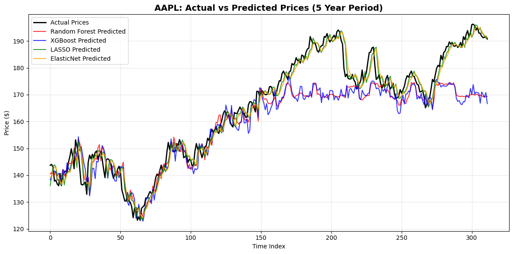
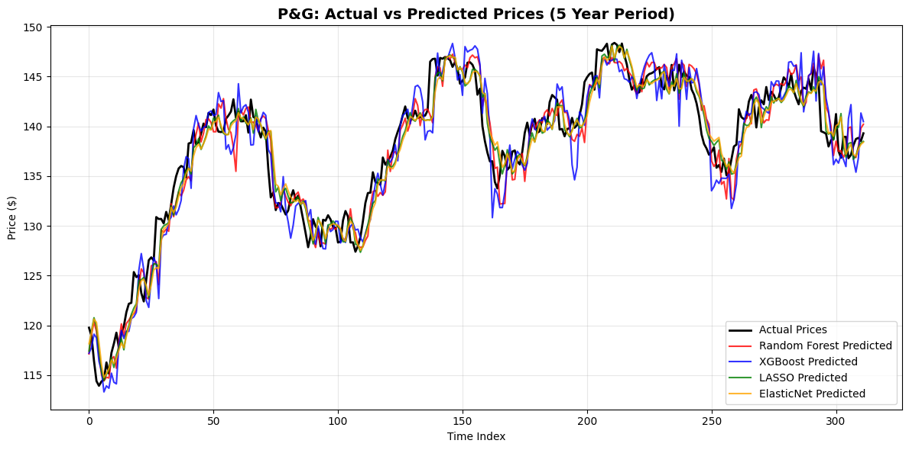
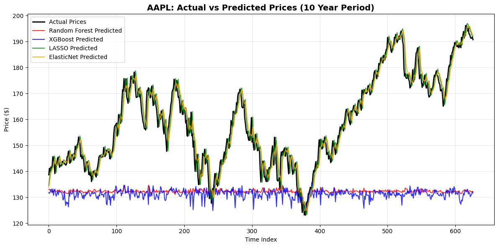
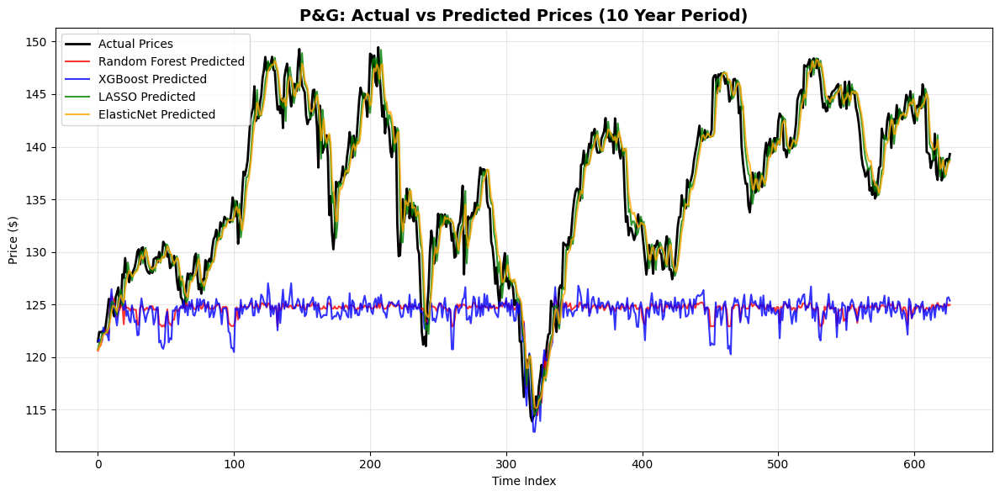

# Findings & Model Interpretation

## Objective
This study evaluates how **stock volatility** and **forecasting horizon** influence the performance of different machine learning models for stock price prediction.

Two stocks with contrasting volatility profiles were analyzed:
- **Apple (AAPL)** – aggressive, high volatility
- **Procter & Gamble (PG)** – defensive, low volatility

Each stock was forecasted over two time horizons:
- **5-year period (2019–2023)** – short to medium term
- **10-year period (2014–2023)** – long term

The models evaluated include:
- Random Forest  
- XGBoost  
- LASSO Regression  
- Elastic Net Regression  

Model performance was assessed using **MAE, RMSE, MAPE, and R²**.

---

## 1. Volatility Classification Rationale

To objectively justify the classification of **Apple (AAPL)** as a volatile (aggressive) stock and **Procter & Gamble (PG)** as a defensive (less volatile) stock, two widely accepted financial risk measures were calculated:

- **Annualized Volatility (σ)**
- **Beta Coefficient (β)** relative to the S&P 500

The S&P 500 index was used as the market benchmark to ensure comparability with broader market risk.

---

### 1.1 Annualized Volatility (σ)

Annualized volatility measures the dispersion of daily returns on a yearly basis and is a standard proxy for total risk.

The calculation is defined as:

\[
\sigma = sd \times \sqrt{252}
\]

Where:
- `sd` is the standard deviation of **daily log returns**
- `252` represents the approximate number of trading days in a year

#### Results
- **AAPL:** σ = **0.2838** (28.38%)
- **PG:** σ = **0.1823** (18.23%)

Apple’s annualized volatility is approximately **10 percentage points higher** than Procter & Gamble’s, indicating substantially greater price dispersion and risk.

This result supports classifying AAPL as a **high-volatility asset**, while PG exhibits the characteristics of a **stable, defensive stock**.

---

### 1.2 Beta Coefficient (β) — Market-Relative Risk

While volatility captures absolute risk, the **beta coefficient** measures a stock’s sensitivity to overall market movements.

Beta is calculated as:

\[
\beta_i = \frac{\text{Cov}(R_i, R_m)}{\text{Var}(R_m)}
\]

Where:
- \(R_i\) = stock returns
- \(R_m\) = S&P 500 returns

Interpretation:
- β > 1 → more volatile than the market (aggressive)
- β < 1 → less volatile than the market (defensive)

#### Results
- **AAPL:** β = **1.1904**
- **PG:** β = **0.5756**

Apple’s beta above 1 confirms that it amplifies market movements, while Procter & Gamble’s beta well below 1 indicates strong defensive behavior.

---

### 1.3 Volatility Classification Summary

| Stock | Annualized Volatility (σ) | Beta (β) | Classification |
|-----|---------------------------|----------|---------------|
| AAPL | 28.38% | 1.1904 | Aggressive / Volatile |
| PG | 18.23% | 0.5756 | Defensive / Stable |

The consistency between **absolute volatility (σ)** and **market-relative risk (β)** provides strong empirical justification for the volatility-based stock classification used throughout this study.

---

## 2. Results: 5-Year Forecasting Horizon (2019–2023)

### 2.1 Apple (AAPL) — Aggressive Stock

- **LASSO** achieved the strongest performance:
  - Lowest MAE and RMSE
  - R² ≈ 0.97
- **Elastic Net** followed closely with similar accuracy
- Tree-based models showed:
  - Higher error rates
  - Poor handling of sharp price fluctuations

**Interpretation:**  
High volatility amplified noise, causing ensemble methods to overfit short-term movements, while regularized linear models maintained stability.

---

### 2.2 Procter & Gamble (PG) — Defensive Stock

- All models performed relatively well
- Tree-based models improved substantially compared to AAPL
- **LASSO remained the most accurate overall**

**Interpretation:**  
Lower volatility reduced forecasting complexity and improved model reliability across all approaches.

---

## 3. Results: 10-Year Forecasting Horizon (2014–2023)

### 3.1 Apple (AAPL) — Long-Term Forecast

- Tree-based models deteriorated sharply:
  - MAE and RMSE increased dramatically
  - R² values turned **negative**
- **LASSO and Elastic Net remained robust**

**Interpretation:**  
Long-term non-stationarity severely impacted complex models, while regularization prevented overfitting.

---

### 3.2 Procter & Gamble (PG) — Long-Term Forecast

- Similar degradation observed in tree-based models
- Linear models maintained high explanatory power (R² > 0.90)

---

## 4. Model Comparison Summary

| Model Type | Short-Term (5Y) | Long-Term (10Y) | Volatility Sensitivity |
|----------|----------------|----------------|------------------------|
| Random Forest | Moderate | Poor | High |
| XGBoost | Moderate | Poor | High |
| LASSO | Excellent | Excellent | Low |
| Elastic Net | Excellent | Very Good | Low |

---

## 5. Key Insights

- Stock volatility significantly impacts forecasting accuracy
- Complex models are **not universally superior**
- Regularization improves robustness in non-stationary markets
- Longer horizons amplify overfitting risks

---

## Conclusion
This study demonstrates that **model effectiveness depends on both asset risk characteristics and forecasting horizon**.

Despite their simplicity, **LASSO and Elastic Net consistently outperformed tree-based models**, offering superior stability, interpretability, and generalization. The findings emphasize that successful predictive analytics is driven not by complexity, but by **alignment between data behavior, model choice, and investment horizon**.
